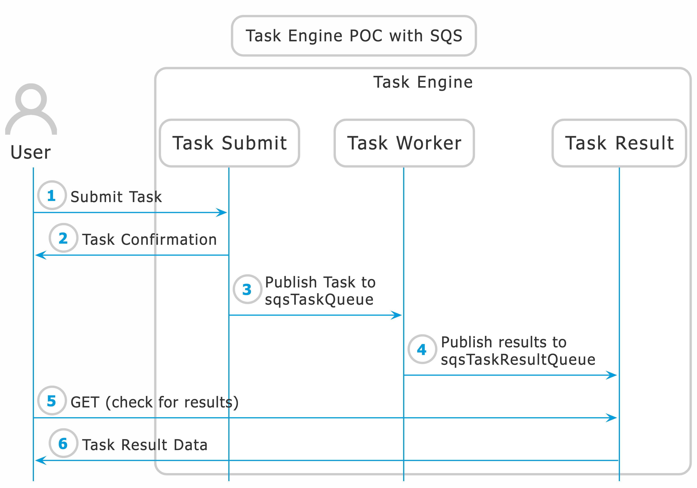

# task-engine-sqs-poc
This is a POC is a rudimentary implementation of the Request-Response Messaging Pattern.  It is simply and effort to see how this may work for implementing a TaskEngine, a component responsible for running tasks based on events or on a schedular. *For all practical purposes it is little more than an echo service today*.

This project uses [localstack](https://github.com/localstack) and [Serverless Application Framework](https://www.serverless.com/) for testing and vetting the approach locally prior to pushing to AWS.  We can then simply provide the appropirate staget to serverless to deploy to our dev, stage, or prod environments.

## NOTE
  ***This is a POC and is not production ready code.***

## Overall Sequence 


1. User sends a request to `taskSubmit` 
2. Task is then published to `sqsTaskQueue`
   a. Confirmation is returned to User
3. TaskWorker listen to `sqsTaskQueue` and process the task.
4. TaskWorker publishes the results of task to `sqsTaskQueueResult`
5. User can periodically check for results using `taskResult` endpoint.  The `taskResult` endpoint which checks `sqsTestTsQueueResult` for results.  If present results are returned or a try agin later is returned.

## Getting started
Clone this repo then run `npm install` from the projects root directory to install the necessary packages from `package.json`

## Environment Requirements

Install serverless:

```
npm install -g serverless
```

Make sure you have serverless-localstack and other plugins are installed

```shell
npm i serverless-deployment-bucket
npm i serverless-iam-roles-per-function
npm i serverless-localstack
npm i serverless-prune-plugin
npm i serverless-webpack
```
  
## Deploy the application

### Localstack

### Creating a CLI Profile for LocalStack
Create a profile for use by localstack by issuing:
```
aws configure --profile localstack
```

This will creat a profile name localstack in the `~.aws/config` file, which should look something like this:

```
[profile localstack]
region = us-west-2
output = json
```

Now this profile can be used with commands to ensure that we are using the right resources.  Local stack does not validate credentials, but will complain if no profile is set.

### Starting Localstack
In a termial window, go to the root directory of the project and start localstack with `docker-compose up`.
   
### Starting Serverless
From another termial window, cd to the projets directory, and start serverless.  I generally start it like this to see any debugging info in the event there are any issues:

#### Local Deploy
```shell
SLS_DEBUG=3 serverless deploy --stage local --profile localstack --region us-west-2
```

#### AWS Dev Deploy
```shell
SLS_DEBUG=3 serverless deploy --stage dev 
```

When the deploy is complete you will be provided the url to the API gateway endpoints.  Use these for invoking the lambdas via http. Output from serverless deploy should look something like this:

```
Service Information
service: task-engine-poc-sqs
stage: local
region: us-west-2
stack: task-engine-poc-sqs-local
resources: 22
api keys:
  None
endpoints:
  http://localhost:4566/restapis/gv7thxca03/local/_user_request_
functions:
  taskSubmit: task-engine-poc-sqs-local-taskSubmit
  jobResult: task-engine-poc-sqs-local-jobResult
  worker: task-engine-poc-sqs-local-worker
layers:
  None
```

## Submit new task

Based on the url's provided under `endpoints`, submit a task to the Task Engine for processing follwoing the steps below.

### Send Message 
```shell
curl -XPOST -d@data/send-message.json \
 http://localhost:4566/restapis/nkj1edfh40/local/_user_request_/sqs/taskSubmit
```

### Check for Response
```shell
curl http://localhost:4566/restapis/nkj1edfh40/local/_user_request_/sqs/taskResult
```

### Check cloudwatch log
```shell
aws --endpoint-url http://localhost:4566 logs tail /aws/lambda/ask-engine-poc-sqs-local-taskSubmit --follow
```


# References

* [Simple SQS Standard Typescript Example](https://github.com/serverless/examples/tree/master/aws-node-typescript-sqs-standard)
* [Request-Response Messaging Pattern (Virtual Queues)](https://docs.aws.amazon.com/AWSSimpleQueueService/latest/SQSDeveloperGuide/sqs-temporary-queues.html#request-reply-messaging-pattern)

